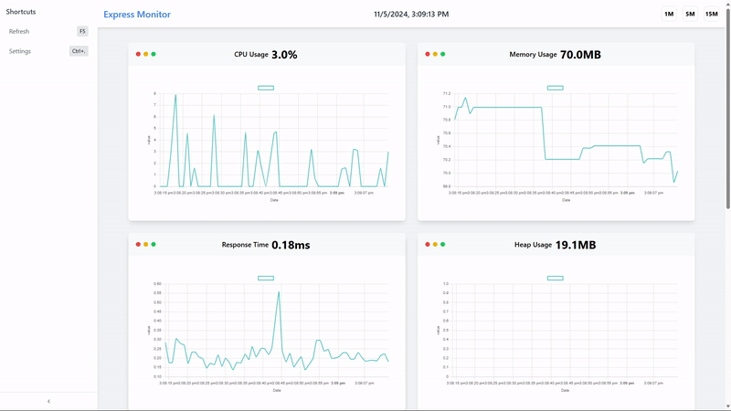

<div align="center">
 <br />
 <h1>
  Express Status Monitor Plus
 </h1>
 <br />
 <p>
  <a href="https://discord.gg/nCQbSag"></a>
  <a href="https://www.npmjs.com/package/express-status-monitor-plus"></a>
  <a href="https://www.npmjs.com/package/express-status-monitor-plus"></a>
  <a href="https://github.com/manhbi18112005/express-status-monitor-plus/actions/workflows/npm-publish.yml"></a>
 </p>
 <p>
  <a href="https://www.cloudflare.com"></a>
 </p>
</div>

> [!IMPORTANT]
> Starting with version 2.0.0, **express-status-monitor-plus** will operate as an independent fork of **express-status-monitor**, given that the original project is no longer maintained. This fork will continue to evolve, with direct updates and maintenance applied to the codebase, ensuring a commitment to new features and timely bug fixes. This allows the project to progress without impacting the original repository, providing users with an actively supported monitoring tool.

A simple, self-hosted module leveraging Socket.io and Chart.js to provide real-time server metrics for Express-based Node.js servers. This version is forked and customized by **MyT** to deliver enhanced functionality and maintain ongoing support.



## Support for other Node.js frameworks

* [koa-monitor](https://github.com/capaj/koa-monitor) for Koa
* [hapijs-status-monitor](https://github.com/ziyasal/hapijs-status-monitor) for hapi.js

## Installation & setup

1. Run `npm install express-status-monitor-plus`
2. Before any other middleware or router add following line:
`app.use(require('express-status-monitor-plus')());`
3. Run server and go to `/status`

Note: This plugin works on Node versions > 8.x

## Run examples

1. Run `npm run dev`
2. Go to `http://localhost:3000`

## Options

Monitor can be configured by passing options object into `expressMonitor` constructor.

Default config:

```javascript
title: 'Express Status Monitor',
theme: 'default.css',
backgroundImage: 'https://cdn.nnsvn.me/botapp/img/bg/bg.jpg',
path: '/status',
socketPath: '/socket.io',
spans: [
  {
    interval: 1,
    retention: 60,
  },
  {
    interval: 5,
    retention: 60,
  },
  {
    interval: 15,
    retention: 60,
  },
],
port: null,
websocket: null, // pass your own socket.io instance; if not passed, one will be created
iframe: false, // display standalone page at /status or inside an iframe
chartVisibility: {
  cpu: true,
  mem: true,
  load: true,
  heap: true,
  eventLoop: true,
  responseTime: true,
  rps: true,
  statusCodes: true,
},
ignoreStartsWith: '/admin',
healthChecks: [],
optimize: true // this use a minified version of page, but it is harder to debug  
```

## Health Checks

You can add a series of health checks to the configuration that will appear below the other stats. The health check will be considered successful if the endpoint returns a 200 status code.

```javascript
// config
healthChecks: [{
  protocol: 'http',
  host: 'localhost',
  path: '/admin/health/ex1',
  port: '3000'
}, {
  protocol: 'http',
  host: 'localhost',
  path: '/admin/health/ex2',
  port: '3000'
}]
```

## Securing endpoint

The HTML page handler is exposed as a `pageRoute` property on the main
middleware function.  So the middleware is mounted to intercept all requests
while the HTML page handler will be authenticated.

Example using <https://www.npmjs.com/package/connect-ensure-login>

```javascript
const ensureLoggedIn = require('connect-ensure-login').ensureLoggedIn()

const statusMonitor = require('express-status-monitor')();
app.use(statusMonitor);
app.get('/status', ensureLoggedIn, statusMonitor.pageRoute)
```

Credits to [@mattiaerre](https://github.com/mattiaerre)

Example using [http-auth](https://www.npmjs.com/package/http-auth)

```javascript
const auth = require('http-auth');
const basic = auth.basic({realm: 'Monitor Area'}, function(user, pass, callback) {
  callback(user === 'username' && pass === 'password');
});

// Set '' to config path to avoid middleware serving the html page (path must be a string not equal to the wanted route)
const statusMonitor = require('express-status-monitor')({ path: '' });
app.use(statusMonitor.middleware); // use the "middleware only" property to manage websockets
app.get('/status', basic.check(statusMonitor.pageRoute)); // use the pageRoute property to serve the dashboard html page
```

## Using module with socket.io in project

If you're using socket.io in your project, this module could break your project because this module by default will spawn its own socket.io instance. To mitigate that, fill websocket parameter with your main socket.io instance as well as port parameter.

## Tests and coverage

In order to run test and coverage use the following npm commands:

```bash
npm test
npm run coverage
```

## License

[MIT License](https://opensource.org/licenses/MIT)
